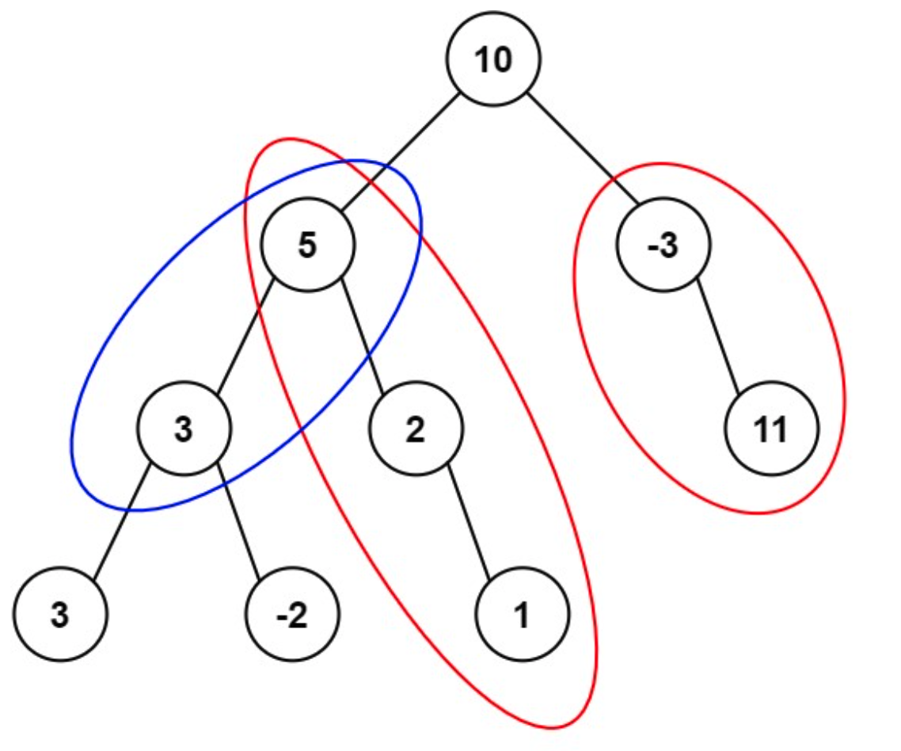

# LC 437. Path Sum III

Link: https://leetcode.com/problems/path-sum-iii/

## Description

Given the `root` of a binary tree and an integer `targetSum`, return the number of paths where the sum of the values along the path equals `targetSum`.

The path does not need to start or end at the root or a leaf, but it must go downwards (i.e., traveling only from parent nodes to child nodes).

** Example **



Input: root = [10,5,-3,3,2,null,11,3,-2,null,1], targetSum = 8 \
Output: 3 \
Explanation: The paths that sum to 8 are shown. \

## Write-up

The idea is like doing a prefix sum on the tree. The similar question on an array is LC 560. Subarray Sum Equals K and the solution for it is as follows:

```
class Solution:
    def subarraySum(self, nums: List[int], k: int) -> int:
        total = 0
        sums = defaultdict(int)
        sums[0] = 1
        res = 0
        for n in nums:
            total += n
            if total - k in sums:
                res += sums[total - k]
            sums[total] += 1
        return res
```

Then for LC 437, it's similar. What's changed is that we need to do a traveral over a tree instead of an array.

For an array, when we're at an index `i`, there's only one next element that is `i+1`. But for a binary tree, when we're at a node `root`, there are 2 next elements to traverse, `root.left` and `root.right`.

With the above idea, it's straighforward to get the following solution:
```
class Solution:
    def pathSum(self, root: Optional[TreeNode], targetSum: int) -> int:
        sums = defaultdict(int)
        sums[0] = 1
        
        def dfs(root, total):
            count = 0
            if root:
                total += root.val
                if total - targetSum in sums:
                    count += sums[total - targetSum]
                sums[total] += 1
                count += dfs(root.left, total) + dfs(root.right, total)
                sums[total] -= 1
            return count
        
        return dfs(root, 0)
```

The solution uses backtracking algorithm so we need to do `sums[total] -= 1` when we finish exploring a node. Imagine root is any node in the tree, it's just one of the 2 alternatives to traverse so when we are done with it, we need to remove its state to avoid affecting the exploration on the other node. For example,

```
   1 
  / \ 
 -2 -3 

targetSum = -1
```
When we explore node -2, the states are:
- `sums`: `{0: 1, 1: 1, -1: 1}`
- `total`: `-1`

If we don't remove key `-1` from `sums`, when we explore node `-3`, `total` is `-3 + 1 = -2`. It will check whether `-2 - -1 = -1` exists in `sums` and it would find `sums[-1]=1` and count the path `1 -> -2 -> -3` as a valid solution.

The key point to understand why we do `sums[total] -= 1` is that `sums` is shared by all paths. When we are done exploring one path, we need to clean up the states for other paths. However, when we do the prefix sum on an array, there's only one path, i.e., index `0 -> 1 -> 2 -> ... -> len(array)-1`.
