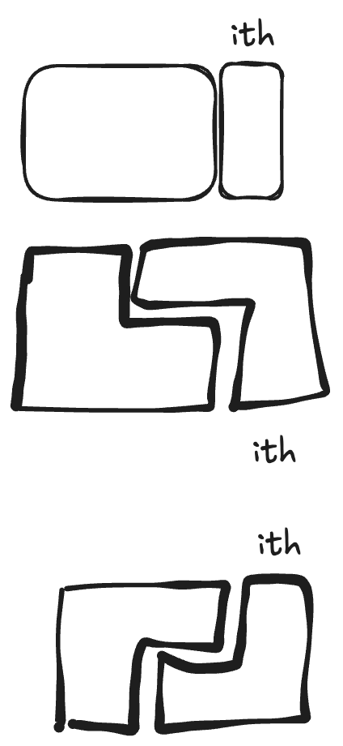
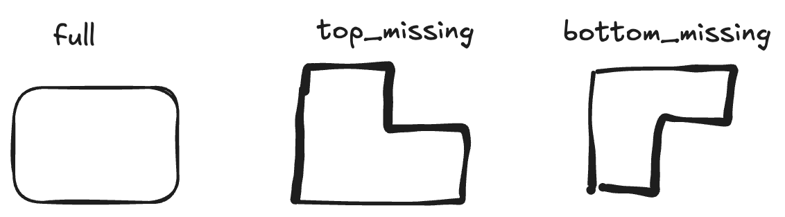
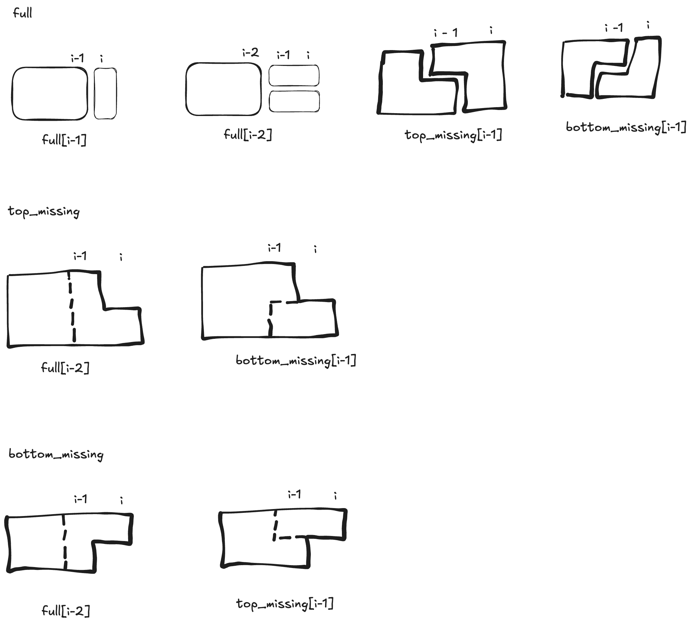

This post discusses the 2 problems together because they have something in common.

## LC 790 - Domino and Tromino Tiling

https://leetcode.com/problems/domino-and-tromino-tiling

Let dp[i] represent how many ways to tile a 2 * (i + 1) board. There are 3 ways to reach the (i + 1)'s column. (Bear with the poor drawing.)



Thus we can use 3 states.
- `full[i]`: how many ways to reach a full rectangle of (i+1) columns
- `top_missing[i]`: how many ways to reach a shape that a rectangle misses a square on its top right corner.
- `bottom_missing[i]`: how many ways to reach a shape that a rectangle misses a square on its bottom right corner.



The state transition is as follows:
```
full[i] = full[i - 1] + full[i - 2] + top_missing[i - 1] + bottom_missing[i - 1]
top_missing[i] = full[i - 2] + bottom_missing[i - 1]
bottom_missing[i] = full[i - 2] + top_missing[i - 1]
```



Base state:
- It's obvious that `top_missing[0] = 0` and `bottom_missing[0] = 0`
- For `full`, it's obvious `full[1] = 1` but how about `full[0]`? Since `full[2] = full[1] + full[0] = 2`, we should manually set `full[0]` to `1`. Note, the meaning of `full[0]` is vague because you can say there's no way to tile a `2*0` rectangle (which doesn't exist) or you can say there's only one way to tile a `2*0` rectangle and that is no way. So we should use `full[2]`'s value to induce `full[0]`.

Full code is:
```
class Solution:
    def numTilings(self, n: int) -> int:
        full = [0] * (n + 1)
        top_missing = [0] * (n + 1)
        bottom_missing = [0] * (n + 1)
        full[0] = 1
        full[1] = 1
        for i in range(2, n + 1):
            full[i] = full[i - 1] + full[i - 2] + top_missing[i - 1] + bottom_missing[i - 1]
            top_missing[i] = full[i - 2] + bottom_missing[i - 1]
            bottom_missing[i] = full[i - 2] + top_missing[i - 1]
        return full[-1] % (10 ** 9 + 7)
```

## LC 714 - Best Time to Buy and Sell Stock with Transaction Fee

https://leetcode.com/problems/best-time-to-buy-and-sell-stock-with-transaction-fee

When we're at `i`th day, there are 2 possibilities: we don't have any stocks at hand and we have 1 stock.

We can use 2 states for the possibilities:
- `free[i]`: no stock at `i`th day.
- `hold[i]`: have 1 stock at `i`th day.

The state transations are:
```
free[i] = max(hold[i - 1] + prices[i] - fee, free[i - 1])
hold[i] = max(free[i - 1] - prices[i], hold[i - 1])
```

Full code is:
```
class Solution:
    def maxProfit(self, prices: List[int], fee: int) -> int:
        n = len(prices)
        hold, free = [0] * n, [0] * n
        hold[0] = -prices[0]

        for i in range(1, n):
            hold[i] = max(hold[i - 1], free[i - 1] - prices[i])
            free[i] = max(free[i - 1], hold[i - 1] + prices[i] - fee)
        return free[-1]
```

## Summary
The common thing in these 2 problems are there are multiple ways to reach position i and these ways cannot be represented with just one state so we need multiple states.

Note, LC790 can be solved with just 1 state but that's out of scope of this blog post. In this post, I just want to discuss the move intuitive solution.
